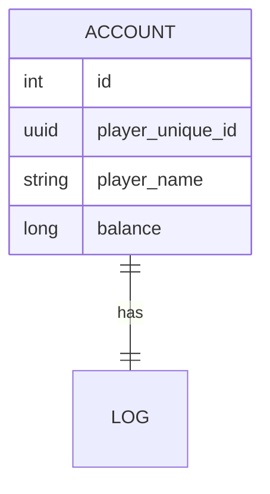

# データベース

KerriaはSQLiteとPostgreSQLをサポートしています。

## Table

### Account

<table>
  <tr>
    <th>Column</th>
    <th>Type</th>
    <th>Comment</th>
  </tr>
  <tr>
    <td>id</td>
    <td>uuid v7</td>
    <td>プライマリーキー</td>
  </tr>
  <tr>
    <td>player_unique_id</td>
    <td>uuid v4</td>
    <td>プレイヤーのUUID</td>
  </tr>
  <tr>
    <td>player_name</td>
    <td>string</td>
    <td>プレイヤーの名前</td>
  </tr>
</table>

### Balance

### Currency
<table>
    <tr>
        <th>Column</th>
        <th>Type</th>
        <th>Comment</th>
    </tr>
    <tr>
        <td>id</td>
        <td>Int</td>
        <td>プライマリーキー</td>
    </tr>
    <tr>
        <td>name</td>
        <td>varchar(20)</td>
        <td>通貨名 ex) "円", "ドル", "ユーロ"</td>
    </tr>
    <tr>
        <td>plural</td>
        <td>varchar(20)</td>
        <td>通貨の複数形 ex) "JPY", "USD", "EUR"</td>
    </tr>
    <tr>
        <td>sign</td>
        <td>varchar(10)</td>
        <td>通貨記号 ex) "¥", "$", "€"</td>
    </tr>
</table>

### TransactionLog

## ER図

