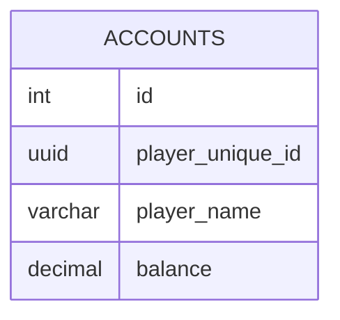

import { UUIDV7 } from '@site/src/components/uuid-example';
import { UUIDV4 } from '@site/src/components/uuid-example';
import { Timestamp } from '@site/src/components/timestamp';

# データベース

KerriaはSQLiteとPostgreSQLをサポートしています。

## Table definition

### ACCOUNTS

<table>
    <thead>
        <tr>
            <th>column name</th>
            <th>type</th>
            <th>example</th>
            <th>description</th>
        </tr>
    </thead>
    <tbody>
        <tr>
            <td>id</td>
            <td>uuid v7</td>
            <td><UUIDV7 /></td>
            <td>主キー Kerria用のアカウントID</td>
        </tr>
        <tr>
            <td>minecraft_unique_id</td>
            <td>uuid v4   (varchar(36))</td>
            <td><UUIDV4 /></td>
            <td>Minecraft用のプレイヤーID</td>
        </tr>
        <tr>
            <td>player_name</td>
            <td>varchar(16)</td>
            <td>Notch | bank:Race</td>
            <td>プレイヤーの名前</td>
        </tr>
        <tr>
            <td>balance</td>
            <td>decimal(20, 4)</td>
            <td>1,000,000</td>
            <td>残高</td>
        </tr>
        <tr>
            <td>type</td>
            <td>enum</td>
            <td>player | bank</td>
            <td>アカウントの種類</td>
        </tr>
    </tbody>
</table>

### ACCOUNT_BALANCE

<table>
    <thead>
        <tr>
            <th>column name</th>
            <th>type</th>
            <th>example</th>
            <th>description</th>
        </tr>
    </thead>
    <tbody>
        <tr>
            <td>account_unique_id</td>
            <td>uuid v7   (varchar(36))</td>
            <td><UUIDV7 /></td>
            <td>主キー</td>
        </tr>
        <tr>
            <td>balance</td>
            <td>decimal(20, 4)</td>
            <td>1,000,000</td>
            <td>残高</td>
        </tr>
        <tr>
            <td>currency_id</td>
            <td>int</td>
            <td>1</td>
            <td>通貨ID</td>
        </tr>
        
    </tbody>
</table>

### CURRENCIES

<table>
    <thead>
        <tr>
            <th>column name</th>
            <th>type</th>
            <th>example</th>
            <th>description</th>
        </tr>
    </thead>
    <tbody>
        <tr>
            <td>id</td>
            <td>int</td>
            <td>1</td>
            <td>主キー</td>
        </tr>
        <tr>
            <td>name</td>
            <td>varchar(50)</td>
            <td>JPY | USD | 葉っぱ</td>
            <td>通貨名</td>
        </tr>
        <tr>
            <td>minor_name</td>
            <td>varchar(50)</td>
            <td>銭 | セント | 葉っぱ</td>
            <td>小数点以下の桁数の名前</td>
        </tr>
        <tr>
            <td>plural</td>
            <td>varchar(50)</td>
            <td>円 | ドル | 落ち葉</td>
            <td>通貨の複数形</td>
        </tr>
        <tr>
            <td>minor_plural</td>
            <td>varchar(50)</td>
            <td>銭 | セント | 葉っぱ</td>
            <td>小数点以下の桁数の複数形</td>
        </tr>
        <tr>
            <td>symbol</td>
            <td>varchar(10)</td>
            <td>￥ | $ | 🍃 | </td>
            <td>通貨記号</td>
        </tr>
        <tr>
            <td>format</td>
            <td>varchar(100)</td>
            <td>#,##0.##\<plural>     \<symbol> #,##0</td>
            <td>通貨フォーマット   ex) 1,000.00円 | 1,000🍃</td>
        </tr>
    </tbody>
</table>

### ACCOUNT_BALANCE_HISTORY

<table>
    <thead>
        <tr>
            <th>column name</th>
            <th>type</th>
            <th>example</th>
            <th>description</th>
        </tr>
    </thead>
    <tbody>
        <tr>
            <td>id</td>
            <td>int</td>
            <td>1</td>
            <td>主キー</td>
        </tr>
        <tr>
            <td>account_unique_id</td>
            <td>uuid v7   (varchar(36))</td>
            <td><UUIDV7 /></td>
            <td>Kerria用のアカウントID</td>
        </tr>
        <tr>
            <td>amount</td>
            <td>decimal(20, 4)</td>
            <td>1,000,000</td>
            <td>金額 (マイナスも可)</td>
        </tr>
        <tr>
            <td>currency_id</td>
            <td>int</td>
            <td>1</td>
            <td>通貨ID</td>
        </tr>
        <tr>
            <td>treate_plugin_name</td>
            <td>varchar(100)</td>
            <td>Kerria | QuickShop  </td>
            <td>取引を処理したプラグインの名前</td>
        </tr>
        <tr>
            <td>message</td>
            <td>varchar(100)</td>
            <td>おこづかい | 購入 | 売却</td>
            <td>取引のメッセージ</td>
        </tr>
        <tr>
            <td>timestamp</td>
            <td>datetime</td>
            <td><Timestamp /></td>
            <td>取引日時 (ISO 8601)</td>
        </tr>
    </tbody>
</table>

## ER図

```mermaid
erDiagram

    ACCOUNTS {
        int id
        uuid player_unique_id
        varchar player_name
        decimal balance
    }

```