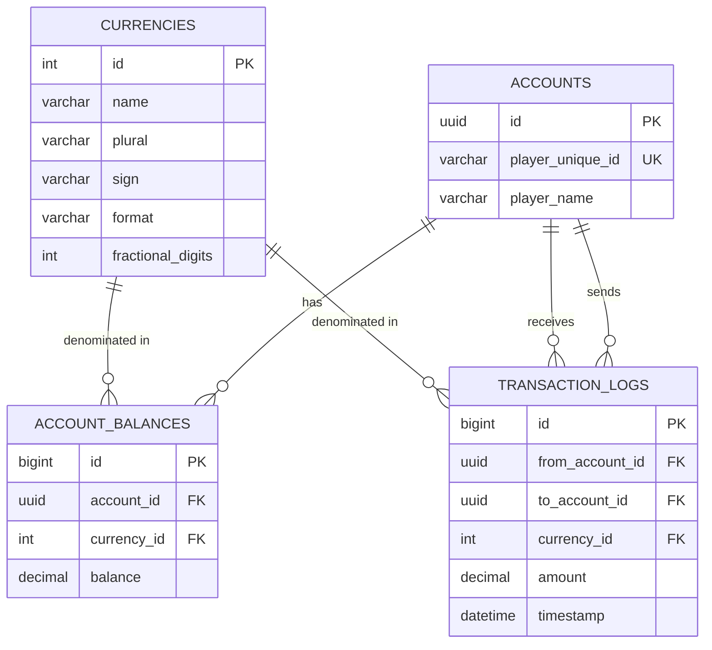

import { UUIDV7 } from '@site/src/components/uuid-example';
import { UUIDV4 } from '@site/src/components/uuid-example';
import { Timestamp } from '@site/src/components/timestamp';

# データベース

KerriaはSQLiteとPostgreSQLをサポートしています。

## Table definition

### ACCOUNTS

プレイヤーのアカウント情報を管理するテーブルです。

<table>
    <thead>
        <tr>
            <th>column name</th>
            <th>type</th>
            <th>example</th>
            <th>description</th>
        </tr>
    </thead>
    <tbody>
        <tr>
            <td>id</td>
            <td>uuid v7</td>
            <td><UUIDV7 /></td>
            <td>主キー Kerria用のアカウントID</td>
        </tr>
        <tr>
            <td>player_unique_id</td>
            <td>varchar(36)</td>
            <td><UUIDV4 /></td>
            <td>MinecraftプレイヤーのUUID（一意インデックス）</td>
        </tr>
        <tr>
            <td>player_name</td>
            <td>varchar(16)</td>
            <td>Notch</td>
            <td>プレイヤーの名前</td>
        </tr>
    </tbody>
</table>

### ACCOUNT_BALANCES

アカウントごとの通貨別残高を管理するテーブルです。1つのアカウントに対して複数の通貨の残高を保持できます。

<table>
    <thead>
        <tr>
            <th>column name</th>
            <th>type</th>
            <th>example</th>
            <th>description</th>
        </tr>
    </thead>
    <tbody>
        <tr>
            <td>id</td>
            <td>bigint</td>
            <td>1</td>
            <td>主キー（自動採番）</td>
        </tr>
        <tr>
            <td>account_id</td>
            <td>uuid v7</td>
            <td><UUIDV7 /></td>
            <td>外部キー → ACCOUNTS(id)</td>
        </tr>
        <tr>
            <td>currency_id</td>
            <td>int</td>
            <td>1</td>
            <td>外部キー → CURRENCIES(id)</td>
        </tr>
        <tr>
            <td>balance</td>
            <td>decimal(20, 4)</td>
            <td>1,000,000</td>
            <td>残高</td>
        </tr>
    </tbody>
</table>

:::info 複合一意インデックス
`(account_id, currency_id)` の組み合わせに対して一意インデックスが設定されています。
1つのアカウントにつき、同じ通貨の残高レコードは1つだけ存在します。
:::

### CURRENCIES

通貨の定義を管理するテーブルです。

<table>
    <thead>
        <tr>
            <th>column name</th>
            <th>type</th>
            <th>example</th>
            <th>description</th>
        </tr>
    </thead>
    <tbody>
        <tr>
            <td>id</td>
            <td>int</td>
            <td>1</td>
            <td>主キー（自動採番）</td>
        </tr>
        <tr>
            <td>name</td>
            <td>varchar(50)</td>
            <td>JPY | USD | 葉っぱ</td>
            <td>通貨名</td>
        </tr>
        <tr>
            <td>plural</td>
            <td>varchar(50)</td>
            <td>円 | ドル | 落ち葉</td>
            <td>通貨の複数形</td>
        </tr>
        <tr>
            <td>sign</td>
            <td>varchar(10)</td>
            <td>￥ | $ | 🍃</td>
            <td>通貨記号</td>
        </tr>
        <tr>
            <td>format</td>
            <td>varchar(100)</td>
            <td>#,##0.##\<plural>     \<symbol> #,##0</td>
            <td>通貨フォーマット   ex) 1,000.00円 | 1,000🍃</td>
        </tr>
        <tr>
            <td>fractional_digits</td>
            <td>int</td>
            <td>2</td>
            <td>小数点以下の桁数</td>
        </tr>
    </tbody>
</table>

### TRANSACTION_LOGS

すべての取引の履歴を記録するテーブルです。

<table>
    <thead>
        <tr>
            <th>column name</th>
            <th>type</th>
            <th>example</th>
            <th>description</th>
        </tr>
    </thead>
    <tbody>
        <tr>
            <td>id</td>
            <td>bigint</td>
            <td>1</td>
            <td>主キー（自動採番）</td>
        </tr>
        <tr>
            <td>from_account_id</td>
            <td>uuid v7</td>
            <td><UUIDV7 /></td>
            <td>外部キー → ACCOUNTS(id)。送金元アカウント</td>
        </tr>
        <tr>
            <td>to_account_id</td>
            <td>uuid v7</td>
            <td><UUIDV7 /></td>
            <td>外部キー → ACCOUNTS(id)。送金先アカウント</td>
        </tr>
        <tr>
            <td>currency_id</td>
            <td>int</td>
            <td>1</td>
            <td>外部キー → CURRENCIES(id)</td>
        </tr>
        <tr>
            <td>amount</td>
            <td>decimal(20, 4)</td>
            <td>500.0000</td>
            <td>取引金額</td>
        </tr>
        <tr>
            <td>timestamp</td>
            <td>datetime</td>
            <td><Timestamp /></td>
            <td>取引日時 (ISO 8601)</td>
        </tr>
    </tbody>
</table>

## ER図

```mermaid
erDiagram
    ACCOUNTS {
        uuid id PK
        varchar player_unique_id UK
        varchar player_name
    }

    ACCOUNT_BALANCES {
        bigint id PK
        uuid account_id FK
        int currency_id FK
        decimal balance
    }

    CURRENCIES {
        int id PK
        varchar name
        varchar plural
        varchar sign
        varchar format
        int fractional_digits
    }

    TRANSACTION_LOGS {
        bigint id PK
        uuid from_account_id FK
        uuid to_account_id FK
        int currency_id FK
        decimal amount
        datetime timestamp
    }

    ACCOUNTS ||--o{ ACCOUNT_BALANCES : "has"
    CURRENCIES ||--o{ ACCOUNT_BALANCES : "denominated in"
    ACCOUNTS ||--o{ TRANSACTION_LOGS : "sends"
    ACCOUNTS ||--o{ TRANSACTION_LOGS : "receives"
    CURRENCIES ||--o{ TRANSACTION_LOGS : "denominated in"
```
